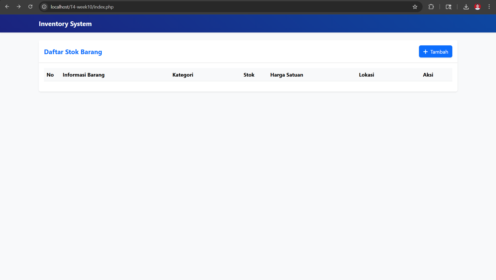
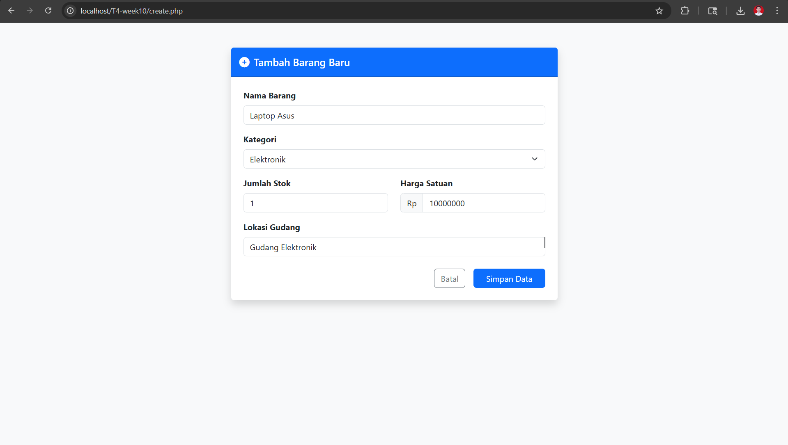
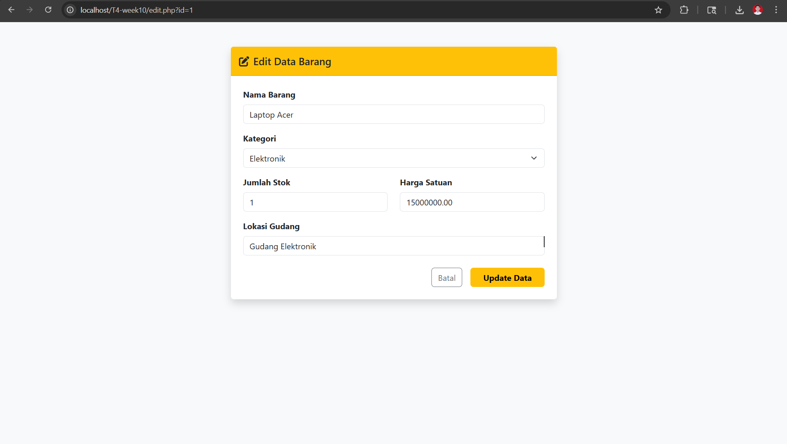
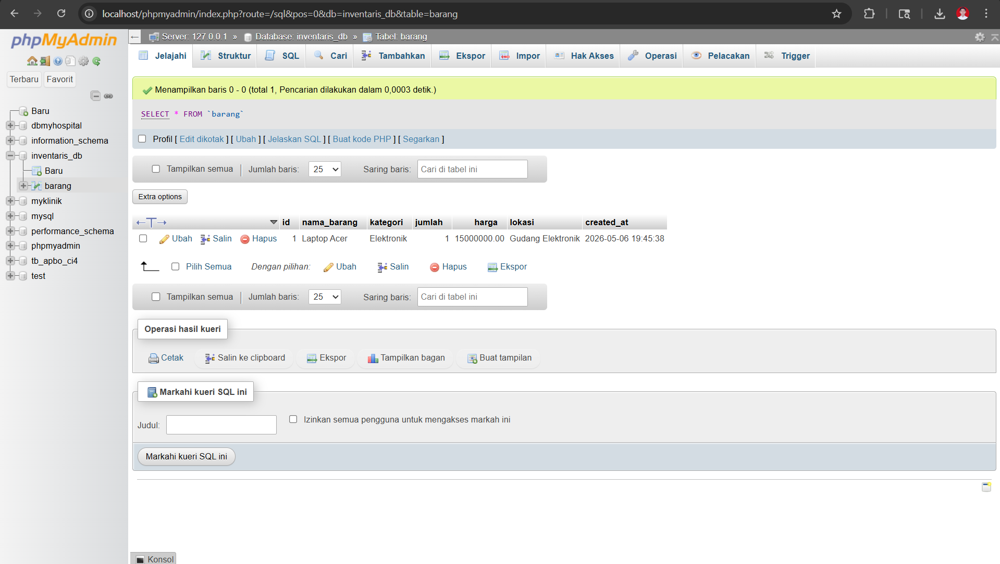

# T4-week10 - Aplikasi CRUD PHP MySQL

Nama : Muhammad Rifqy Habibi

NIM : F1D02410080

Kelas : Pemrograman Web

## Deskripsi

Aplikasi CRUD (Create, Read, Update, Delete) menggunakan PHP MySQL, dan Bootstrap.

- Database : inventaris_db

- Tabel : barang

## Cara Menjalankan

1. Import file .sql ke phpMyAdmin
2. Letakkan folder project di htdocs/ (XAMPP)
3. Buka browser ke http://localhost/T4-week10/

## Screenshot

### Daftar Data

### Tambah Data

### Edit Data

### Struktur Database (phpMyAdmin)

